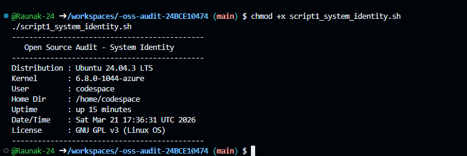
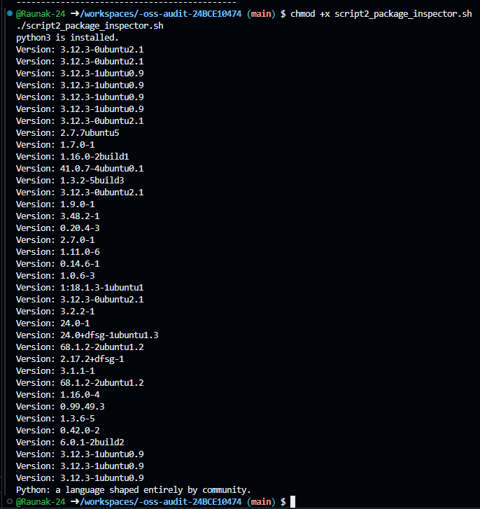
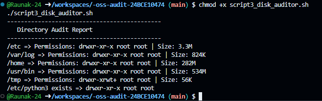
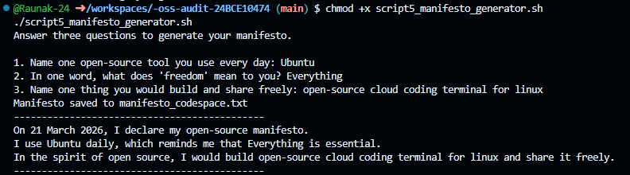

# Open Source Audit – Python

## 📌 Student Details

- **Name:** Shubham Singh
- **Roll Number:** 24BCG10134
- **Course:** Open Source Software (OSS NGMC)
- **Chosen Software:** Python

---

## 📌 Project Overview

This repository showcases my NGMC project for the Open Source Software course, focusing on Python as an open-source technology. It explores its origins, licensing, philosophy, ecosystem, and how it compares with proprietary tools. 

Along with the report, I developed five shell scripts that highlight practical Linux skills and reflect key open-source principles like transparency, collaboration, and automation.

---

## 📌 Repository Contents

```
oss-audit-24BCG10134/
├── README.md
├── system_identity.sh
├── package_inspector.sh
├── disk_auditor.sh
├── log_analyzer.sh
├── manifesto_generator.sh
└── screenshots/
```

---

## 📌 Scripts

### 1. System Identity Report

- **File:** `system_identity.sh`
- **Purpose:** Displays Linux distribution, kernel version, user info, uptime, date/time, and license message.
- **Run:**
  ```bash
  bash system_identity.sh

  ```

### 2. FOSS Package Inspector

- **File:** `package_inspector.sh`
- **Purpose:** Checks if Python is installed, prints version info, and shows a philosophy note using a case statement.
- **Run:**
  ```bash
  bash package_inspector.sh
  ```

### 3. Disk and Permission Auditor

- **File:** `disk_auditor.sh`
- **Purpose:** Loops through key system directories, reports size and permissions, and checks Python config directory.
- **Run:**
  ```bash
  bash disk_auditor.sh

  ```

### 4. Log File Analyzer

- **File:** `log_analyzer.sh`
- **Purpose:** Reads a log file line by line, counts keyword matches (default: “error”), and prints last 5 occurrences.
- **Run:**
  ```bash
  bash log_analyzer.sh /var/log/syslog error
  ```

### 5. Open Source Manifesto Generator

- **File:** `manifesto_generator.sh`
- **Purpose:** Asks the user three questions interactively, generates a personalized open-source manifesto, and saves it to a `.txt` file.
- **Run:**
  ```bash
  bash manifesto_generator.sh
  ```

## 📌 How to Use

- Clone the repository:
  ```bash
  git clone https://github.com/shubhamsingh119/oss_project_24BCG10134/
  cd oss-audit-24BCG10134
  ```
- Make scripts executable:
  ```bash
  chmod +x script*.sh
  ```

## 📌 Dependencies

- Linux system (tested on Ubuntu/Debian)
- Bash shell
- Standard utilities: `ls`, `du`, `grep`, `awk`, `dpkg`

## 📌 ScreenShots

**Script 1 Output**



**Script 2 Output**



**Script 3 Output**



**Script 4 Output**


**Script 5 Output**


